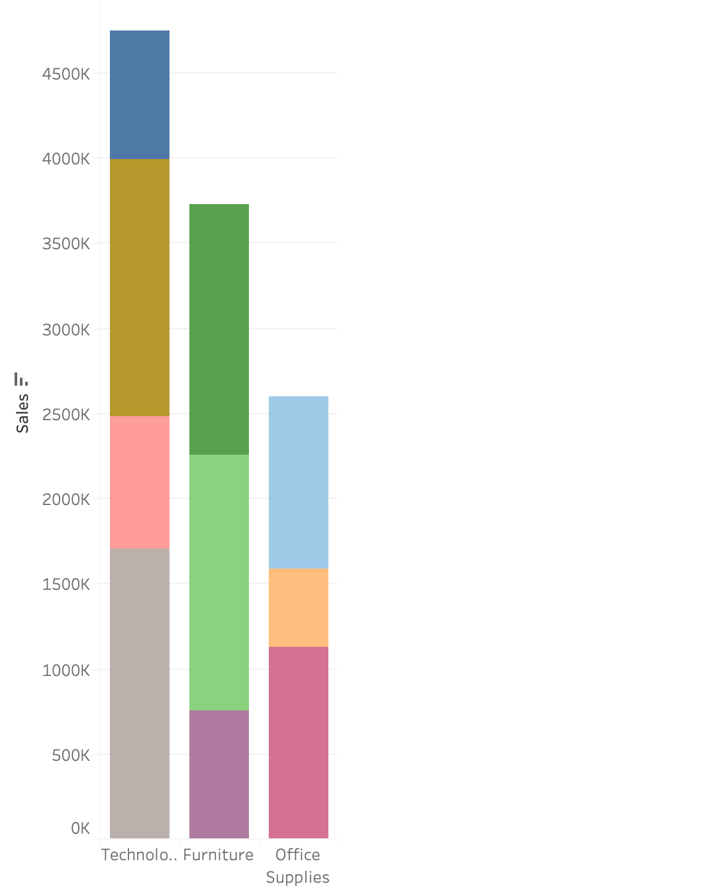
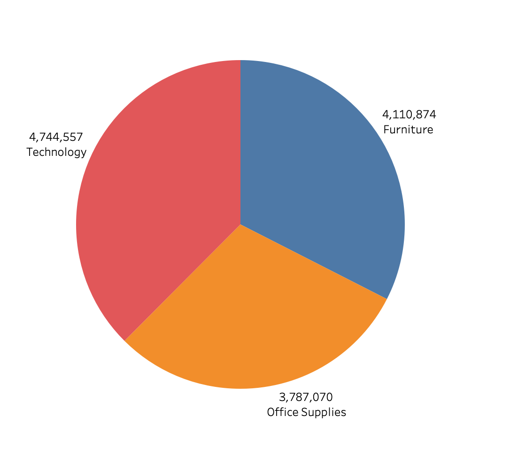
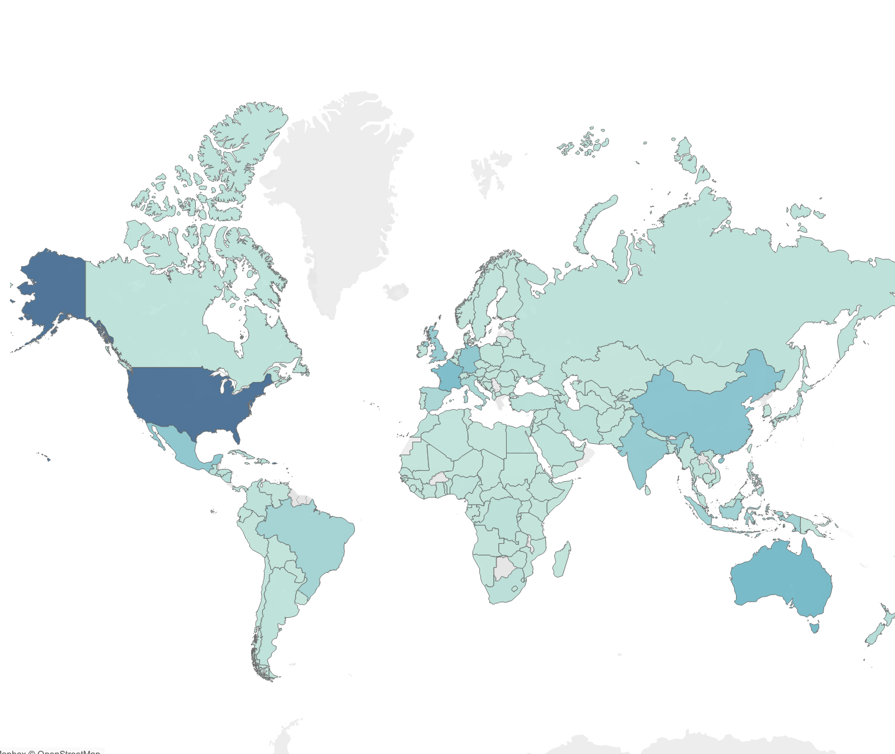
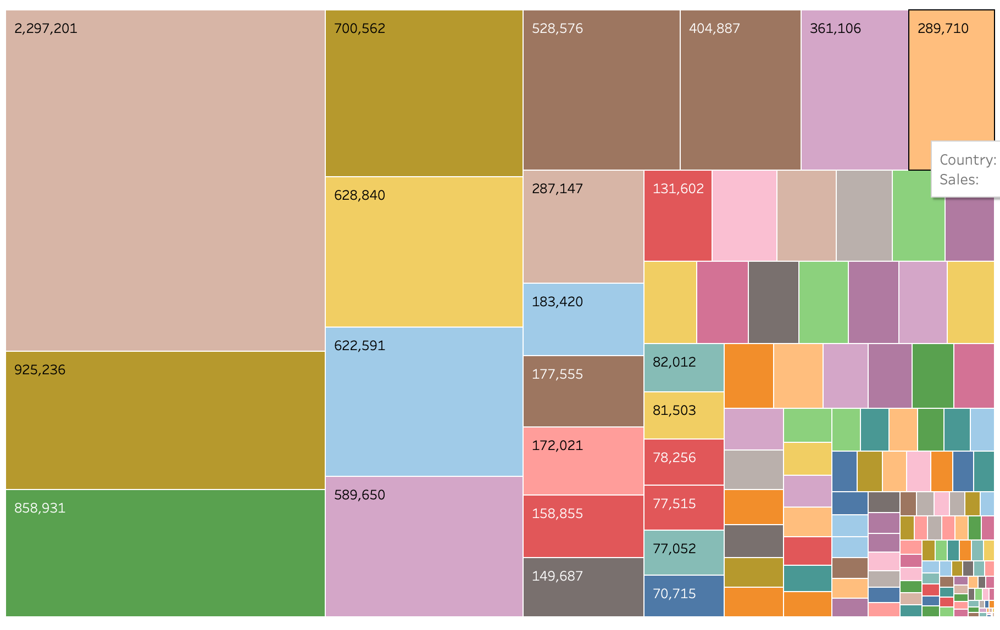

# Globalstore-Tableau-Dashboard
Interactive Tableau dashboard analysing sales performance, profit, and customer trends using the Global Superstore dataset.

# Global Superstore Tableau Dashboard 📊

## Overview

This project uses Tableau to analyse sales performance and business trends using the Global Superstore dataset.

The dashboard was created to identify key insights related to sales, profit, customer behaviour, and regional performance through interactive visualisations.

## Objectives

- Analyse business performance data
- Create interactive Tableau dashboards
- Identify sales and profit trends
- Present data insights visually

## Technologies Used

- Tableau
- Excel
- GitHub

## Skills Demonstrated

- Data Visualisation
- Dashboard Design
- Data Analysis
- Business Intelligence
- KPI Reporting
- Interactive Filtering
- Insight Generation

## Key Insights

- Identified top-performing product categories
- Analysed sales and profit trends
- Compared regional performance
- Explored customer purchasing behaviour

## Dashboard Visualisations
### Sales By Category - Bar Chart

### Sales By Category - Pie Chart

### Filled Map

### Tree Map

